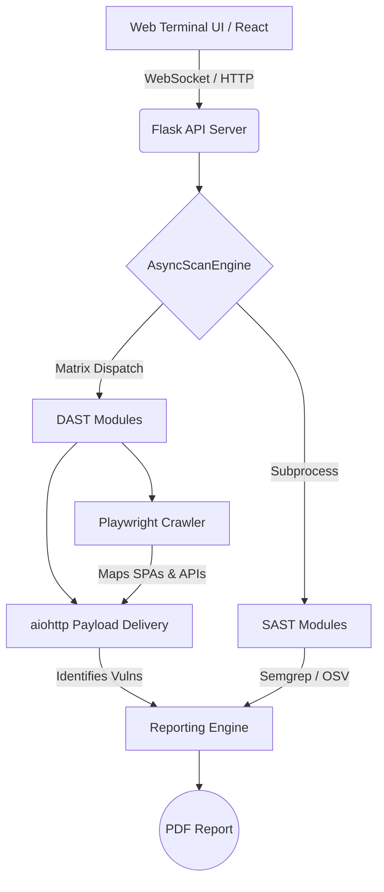

<div align="center">
```
 __        __              _   _     
 \ \      / / __ __ _(_) |_| |__  
  \ \ /\ / / '__/ _` | | __| '_ \ 
   \ V  V /| | | (_| | | |_| | | |
    \_/\_/ |_|  \__,_|_|\__|_| |_|
```

# Wraith
**Silent. Fast. Lethal.**

[](https://www.python.org/)
[](https://nodejs.org/)
[](https://opensource.org/licenses/MIT)
[]()

<p align="center">
  What others miss, Wraith finds. An async DAST & SAST scanning engine built for ethical hackers, red teams, and DevSecOps pipelines.
</p>

</div>

---

## 📖 Table of Contents
- [Overview](#-overview)
- [Key Features](#-key-features)
- [Architecture](#-architecture)
- [Getting Started](#-getting-started)
  - [Prerequisites](#prerequisites)
  - [Installation](#installation)
- [Usage](#-usage)
  - [Web Terminal UI](#1-web-terminal-ui-recommended)
  - [Command Line Interface](#2-command-line-interface-cli)
- [Testing Environment](#-testing-environment)
- [Disclaimer](#-responsible-use-disclaimer)
- [License & Author](#-license--author)

---

## 📖 Overview

**Wraith** is an advanced web vulnerability scanner that unifies **Dynamic Application Security Testing (DAST)** and **Static Application Security Testing (SAST)** into a single, highly concurrent platform.

Unlike traditional scanners that rely on static HTML scraping, Wraith uses a headless browser to dynamically map modern Single Page Applications (SPAs) and intercept hidden API routes. Built on `aiohttp` and `asyncio`, its core engine runs hundreds of non-blocking vulnerability checks simultaneously — without hammering the target server.

---

## ✨ Key Features

### 🚀 High-Performance Core Architecture
* **True Asynchronous Engine:** Powered by `aiohttp`, the matrix dispatcher runs concurrent scanning modules bypassing GIL bottlenecks, reducing comprehensive scan times from hours to minutes.
* **SPA-Aware Reconnaissance:** Utilizes `async_playwright` to dynamically execute JavaScript, hydrate modern web frameworks (React, Angular, Vue), and capture background `fetch`/`XHR` API requests.
* **Smart Concurrency & Throttling:** Implements `asyncio.Semaphore` rate-limiting, exponential backoff, and `429/503` retry logic to ensure stability and prevent accidental Denial-of-Service (DoS).
* **Out-of-Band (OAST) Detection:** Natively integrates with `interactsh` to capture blind, asynchronous vulnerabilities (e.g., SSRF, blind SQLi) via DNS/HTTP callbacks.

### 🔍 Dynamic Scanning (DAST)
Proactively detects critical vulnerabilities across 17 specialized modules:
* **Injection Flaws:** Error-based, boolean-blind, and time-based SQLi, Command Injection (CMDi), and XXE.
* **Client-Side Attacks:** Reflected and DOM-based Cross-Site Scripting (XSS).
* **Broken Access Control:** Insecure Direct Object Reference (IDOR) and Path Traversal.
* **Network & Configuration:** Server-Side Request Forgery (SSRF), Open Redirects, CSRF, and Security Header misconfigurations.

### 🛡️ Static Scanning (SAST)
Analyzes remote GitHub repositories for source-code level vulnerabilities:
* **Semgrep Integration:** AST-based static analysis utilizing both community-driven and custom rulesets.
* **Secrets Detection:** High-entropy string analysis to uncover hardcoded credentials, tokens, and API keys.
* **Dependency Auditing:** Interfaces with the OSV API to identify known CVEs in `package.json` and `requirements.txt` files.

### 📊 Professional Reporting
Generates comprehensive, deduplicated PDF reports featuring:
* Executive summaries coupled with **CVSS v3.1** scoring.
* Granular vulnerability distribution metrics and charts.
* Dynamic, context-aware remediation guidelines.
* Direct mapping to the **OWASP Top 10** framework.

---

## 🏗️ Architecture


---

## 🚀 Getting Started

### Prerequisites
Ensure your system meets the following minimum requirements before installing Wraith:

- **Python:** v3.9 or higher
- **Node.js:** v16 or higher (required for Web Terminal)
- **npm:** v8 or higher
- **Git:** Required for cloning target repositories during SAST scans

### Installation

#### Windows (PowerShell)
```powershell
# 1. Clone the repository
git clone https://github.com/harshraj211/wraith-scanner.git
cd wraith-scanner

# 2. Create and activate a virtual environment
python -m venv venv
.\venv\Scripts\Activate.ps1

# 3. Install Python dependencies
pip install -r requirements.txt

# 4. Install Playwright browser binaries
playwright install chromium

# 5. Initialize required directories
mkdir reports

# 6. Install Web Terminal dependencies
cd scanner-terminal
npm install
cd ..
```

#### Linux / macOS (Bash)
```bash
# Clone the repository
git clone https://github.com/harshraj211/wraith-scanner.git
cd wraith-scanner

# Run the automated install script
chmod +x install.sh
./install.sh
```

---

## 💻 Usage

Wraith can be operated via an interactive browser-based Web Terminal or a traditional Command Line Interface.

### 1. Web Terminal UI (Recommended)

**Start the Backend API:**
```bash
# make sure your virtualenv is active first
python api_server.py
# runs on http://localhost:5001
```

**Start the Frontend Terminal:**
```bash
# open a second terminal window
cd scanner-terminal
npm start
# opens at http://localhost:3000
```

**Available Terminal Commands:**

| Command | Description |
|---|---|
| `scan <url>` | Launch an async DAST scan against a target URL |
| `scanrepo <github-url>` | Clone and run SAST analysis on a remote repository |
| `status <scan-id>` | Check live progress of a running scan |
| `report <scan-id>` | Download the final PDF report |
| `help` | List all available commands |

### 2. Command Line Interface (CLI)
```bash
# standard scan
python main.py --url http://target.com --output reports/report.pdf

# aggressive mode (higher concurrency)
python main.py --url http://target.com --mode aggressive

# custom timeout
python main.py --url http://target.com --timeout 15
```

---

## 🧪 Testing Environment

A deliberately vulnerable Flask app lives in `/test_app` — use it to verify your install and see Wraith in action without touching a real target.
```bash
# terminal 1 — start the vulnerable app
python test_app/vulnerable_app.py

# terminal 2 — run wraith against it
python main.py --url http://127.0.0.1:5000 --output reports/local_test.pdf
```

---

## ⚖️ Responsible Use Disclaimer

Wraith is an ethical hacking tool built exclusively for authorized security assessments and educational purposes.

* **Authorization Required:** Only scan targets you own or have explicit written permission to test.
* **Legality:** Unauthorized scanning is a cybercrime in most jurisdictions.
* **Non-Destructive:** Wraith identifies and reports vulnerabilities — it does not exploit, persist, or exfiltrate.

The developer assumes no liability for misuse, damage, or legal consequences.

---

## 👨‍💻 License & Author

**License:** MIT

**Author:** Harsh Raj — Cyber Security Student & Developer

> *Built Wraith — an async DAST/SAST security scanner with SPA crawling, Semgrep integration, and automated CVSS-scored PDF reporting.*
